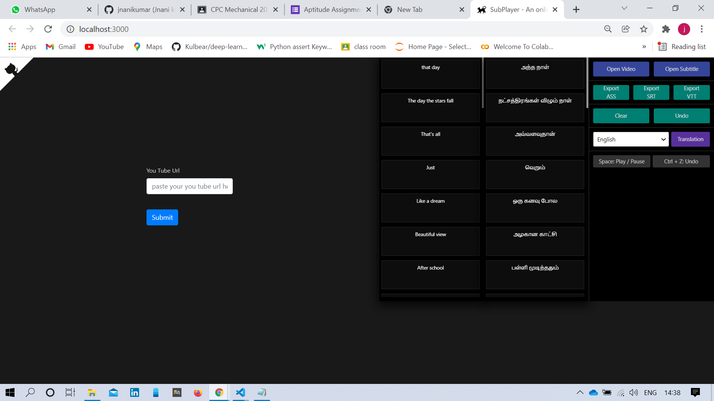
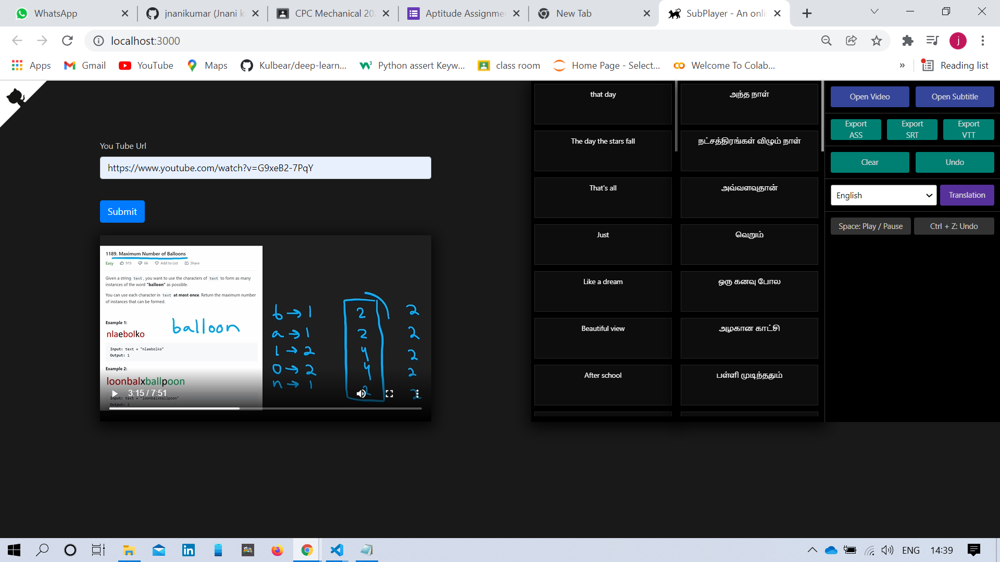
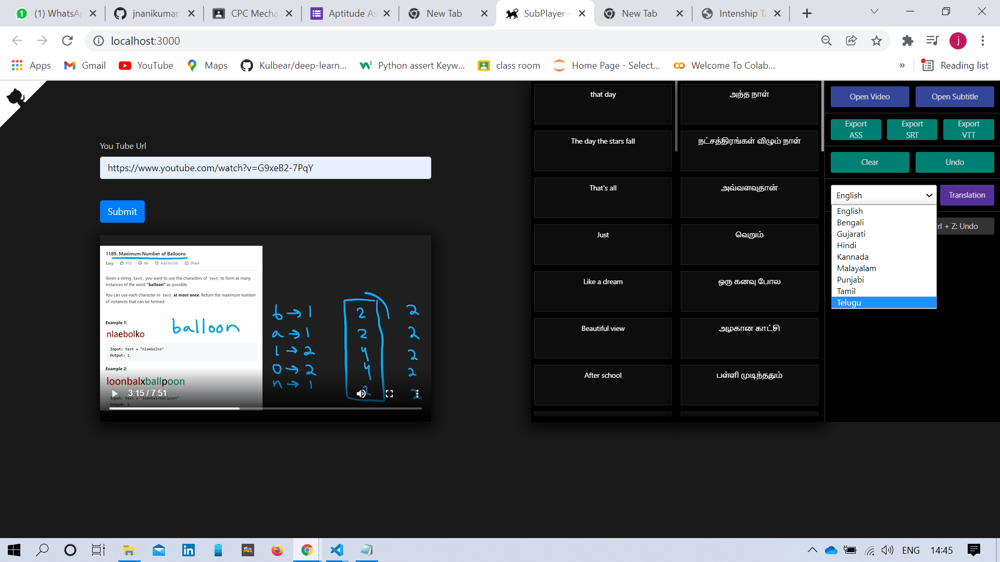

 
 
 initially you have to clone the repo into your local storage 
 
 once its done open the commad prompt or terminal and go it to the main folder (using cd)
 
 
 then run the command npm install which installs all the require packages
 
 once its done enter the command npm start in the same directory which fire's up the react app 
 
 you will see the UI similar to this 
 
 
 
 
 
 
 paste the url of the youtube video you wanted to watch in the input box click submit 
 
 you will notice that the video is playing and corresponding subtitles are showing up as shown in the picture 
 
 
 you can also see that there are only Indian languages in the list displayed in the below image
 
 
 
 
 
 
 
 
 
 
